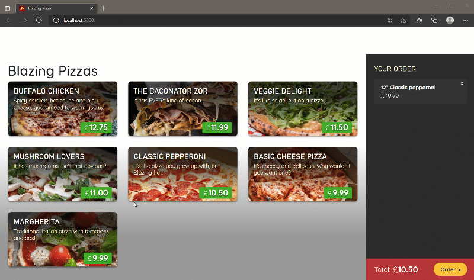

# Blazing Pizza App 🍕

A full-stack interactive web application built with **.NET 9** and **Blazor**. This project simulates a pizza ordering system, demonstrating advanced data interaction patterns, state management, and component-based UI design.

## 🚀 Features

* **Interactive Menu:** Dynamically fetches and displays pizza specials from a database.
* **Customization:** Users can select a pizza, choose its size, and configure specific toppings in a real-time dialog.
* **Live Price Calculation:** The total price updates instantly based on the selected size and toppings.
* **Order Management:** Allows users to place orders and track their status.
* **Data Integration:** Connects to a backend service to retrieve and save data seamlessly.

## 📸 Demo

*See the application in action, including the pizza customization and ordering flow.*



## 🛠️ Technologies Used

* **Framework:** .NET 9
* **Language:** C#
* **Database:** Entity Framework Core (SQLite/SQL Server)
* **Architecture:**
    * **Blazor Components:** Reusable UI blocks (`.razor`) for the menu, index, and order details.
    * **Dependency Injection:** Managing services for HTTP calls and order state.
    * **HttpClient:** Interacting with backend APIs to fetch specials and place orders.
* **Styling:** CSS, Bootstrap.

## 📦 Getting Started

To run this application locally:

1.  **Clone the repository:**
    ```bash
    git clone https://github.com/marius2347/BlazingPizza-using-Blazor-.NET-9-in-CSharp.git
    ```
2.  **Navigate to the project directory:**
    ```bash
    cd BlazingPizza-using-Blazor-.NET-9-in-CSharp
    ```
3.  **Run the application:**
    ```bash
    dotnet run
    ```
4.  Open your browser and navigate to the localhost URL shown in the terminal (usually `https://localhost:7000` or `http://localhost:5000`).

## 📬 Contact

If you have any questions about this project, feel free to reach out:

* **Email:** [mariusc0023@gmail.com](mailto:mariusc0023@gmail.com)
